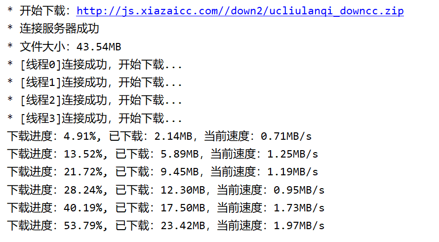
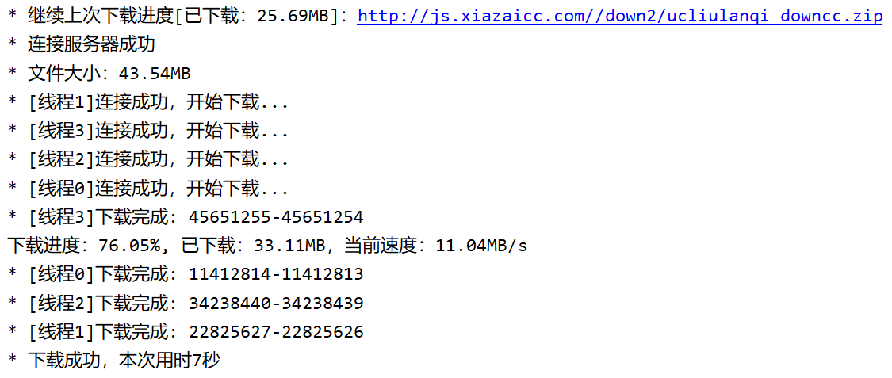

# Downloader

Java实现的一个简单的多线程下载器，支持断点续传。这两项功能已经完成，并能正确执行，但还有一点需要完善的地方。

多线程下载及断点续传的实现是使用 HTTP/1.1 引入的 Range 请求参数

- Downloader: 主类，负责分配任务给各个子线程，及检测进度
- DownloadFile: 表示要下载的哪个文件，为了能写输入到文件的指定位置，使用 RandomAccessFile 类操作文件
- DownloadTask: 实际执行下载的线程，获取 [lowerBound, upperBound] 区间的数据，当下载过程中出现异常时要通知其他线程，结束下载
- Logger: 实时记录下载进度


## 演示：

下载一个文件：



强制结束程序，然后再运行一次：

---
## 增加功能:
###  下载完成后是否删除日志文件[.log文件] (可选)
- Downloader中log_m属性为true时,下载文件完成后删除日志文件

### 下载时是否删除重复文件(可选)
- Downloader中Remove_files属性为true时,下载文件遇到重复(已下载过的)文件会自动删除
### 下载路径如果不存在则会自动创建
- 下载文件时,传入文件路径(包括文件名与后缀)即可,路径不存在会自动创建(默认开启)

---
## 功能更改(不可选):
### 下载失败时默认删除下载时生成的log文件
- 原因:在我的测试中,断点下载功能很容易出错,删除log文件后才能回复正常
### 下载失败时默认删除下载时的文件
- 原因:在我添加的[下载时是否删除重复文件]的功能里发现,下载失败文件并不会消失,文件会存在而且文件大小会"虚大"
### 文件名不会自动获取,需要手动传入
- 原因:原本自动获取文件原理时根据url(字符串)获取的,这中方法局限性很大,改成手动传入见[下载路径如果不存在则会自动创建]

---
## 用法:
``````java
//Main函数里
//下载IDEA安装文件
//四个参数,后面时log_m和Remove_files参数
//后面一定要加".start()",不然就是下载寂寞
new Downloader("https://download.jetbrains.com/idea/ideaIC-2022.3.2.exe","Idea.exe",true,fale).start();
//设置两个线程,默认4个
new Downloader("https://download.jetbrains.com/idea/ideaIC-2022.3.2.exe",2,"Idea.exe",true,fale).start();
